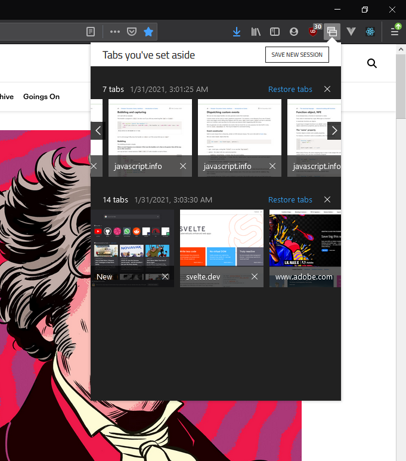

# Set Aside for Mozilla Firefox

Set Aside lets you save your browsing session and pick up where you left off later. 
Saves all your tabs from your current session and saves them locally.
You can then restore any session or start a new one.

This extension can be downloaded from [Firefox Browser Add-ons](https://addons.mozilla.org/en-US/firefox/addon/set-aside-firefox/) 

## Preview

Static:

In action:

